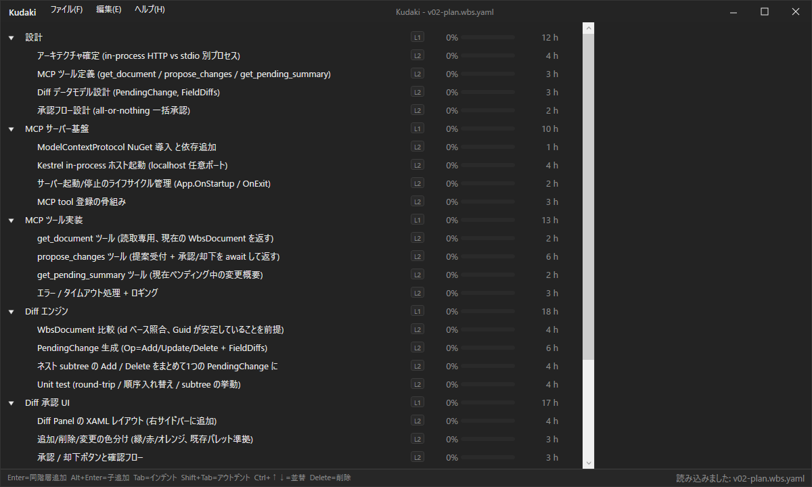

# Kudaki

A keyboard-driven Work Breakdown Structure editor for Windows.



## Overview

Kudaki (from the Japanese verb "to break down") is a small WPF application for building and maintaining hierarchical task plans. It is designed to be faster and less friction-prone than editing a WBS in a spreadsheet: every operation has a keyboard shortcut, progress is derived from the remaining-hours you update daily, and the tool warns you when a leaf task looks too coarse to plan reliably.

Kudaki is Windows-only, single-user, free, and open source.

## Installation

Download `KudakiSetup.exe` from the [latest release](https://github.com/dhq-boiler/Kudaki/releases/latest) and run it.

- Windows 10 or 11, x64
- The .NET 10 runtime is bundled in the installer; no separate download is required
- Installs into the current user profile (`%LOCALAPPDATA%\Programs\Kudaki`); no administrator rights required
- Uninstall from Windows "Apps & features"

## Usage

Kudaki opens in an empty document. Press `Enter` and start typing to add the first task. Every subsequent operation is one keystroke.

### Opening a file

- Launch from the Start Menu
- Or run `Kudaki.exe path\to\plan.wbs.yaml` from a shell to open a file directly
- Or drag a `.wbs.yaml` (or `.yaml` / `.yml`) file onto the window

### Keyboard shortcuts

Tree editing:

| Key                | Action                                                             |
| ------------------ | ------------------------------------------------------------------ |
| `Enter`            | Add a sibling after the selected task (or a top-level task if none is selected) |
| `Alt`+`Enter`      | Add a child under the selected task                                |
| `Tab`              | Indent the selected task (make it a child of the previous sibling) |
| `Shift`+`Tab`      | Outdent the selected task (promote it to a sibling of its parent)  |
| `Ctrl`+`Up`        | Move the selected task up among its siblings                       |
| `Ctrl`+`Down`      | Move the selected task down among its siblings                     |
| `Delete`           | Delete the selected task (including its children)                  |

File:

| Key                    | Action              |
| ---------------------- | ------------------- |
| `Ctrl`+`N`             | New document        |
| `Ctrl`+`O`             | Open                |
| `Ctrl`+`S`             | Save                |
| `Ctrl`+`Shift`+`S`     | Save as             |
| `Ctrl`+`E`             | Export to Markdown  |

### Remaining-hours model

Kudaki does not expose "actual hours" or "percent complete" as editable fields. Instead, you edit a single "remaining hours" value per leaf task each day, and the following are derived:

- **Spent** = `max(0, estimate - remaining)`
- **Progress** = `(estimate - remaining) / estimate`, clamped to 0..100

The rules for a leaf task are:

- Remaining is unset: the task is not started (0% complete)
- Remaining equals the estimate: the task is not started
- Remaining is between 0 and the estimate: in progress
- Remaining is 0: complete
- Remaining exceeds the estimate: the task grew past its original estimate; progress stays at 0 until the estimate is revised

Internal (parent) nodes aggregate the estimates and remainings of their leaves. Their spent and progress are derived from the aggregates.

### Breakdown warning

If a leaf task has an estimate greater than 40 hours, Kudaki marks it with a warning glyph and a note saying it is still too large to plan reliably. This threshold is fixed in v0.1 and will be configurable later.

### Task dependencies

Any task can declare predecessor tasks — tasks that must complete before this one starts. Semantics are Finish-to-Start only: `X -> Y` means every leaf under `X` must complete before any leaf under `Y` can start. Predecessors may sit at any level of the tree, including internal (parent) nodes.

To add a predecessor, select a task and pick one from the "Predecessor tasks" dropdown in the detail pane. Current predecessors are shown as pill chips with an `x` to remove them. Cycles and ancestor/descendant edges are rejected. Indenting or outdenting a task auto-removes any predecessor that would become illegal after the move.

### Arrow diagram

Right-click a parent task in the tree and pick "Show arrow diagram" to open a per-parent Activity-on-Node view. Nodes are laid out with a Kahn topological sort; only edges internal to the current parent scope are drawn. A lightning bolt marker on a child indicates that child has an inbound predecessor from outside the current parent.

A small demo file exercising cross-phase dependencies is in [`docs/deps-demo.wbs.yaml`](docs/deps-demo.wbs.yaml).

## File format

Documents are saved as YAML with the extension `.wbs.yaml`. The format is versioned (`version: 3` in the current release) and is designed to be human-readable, diff-friendly, and easy for tools (including AI agents) to produce or consume. A worked example is in [`docs/v02-plan.wbs.yaml`](docs/v02-plan.wbs.yaml).

Version 3 adds `predecessorIds` on each task. Files saved by v0.1.2 or older (`version: 2`) load unchanged; files saved by v0.1.3 or newer will not load in older releases.

A Markdown export exists for sharing on GitHub or in documentation. It uses task-list syntax (`- [ ]` / `- [x]`) and preserves rolled-up totals and the breakdown warning. See [`docs/v02-plan.md`](docs/v02-plan.md) for a rendered example.

## Building from source

Requires the .NET 10 SDK.

```
git clone https://github.com/dhq-boiler/Kudaki.git
cd Kudaki
dotnet build
dotnet run --project src/Kudaki.App
```

To produce a self-contained release build:

```
dotnet publish src/Kudaki.App -c Release -r win-x64 --self-contained true -o publish/Kudaki.App
```

To rebuild the installer, first zip the published app into `src/Kudaki.Installer/Payload/Kudaki-payload.zip`, then publish the installer as a single-file self-contained executable:

```
dotnet publish src/Kudaki.Installer -c Release -r win-x64 --self-contained true -o publish/Kudaki.Installer
```

## Technology

- C#, WPF, .NET 10
- MVVM: [CommunityToolkit.Mvvm](https://github.com/CommunityToolkit/dotnet) for command generation, [R3](https://github.com/Cysharp/R3) for observable properties
- YAML I/O: [YamlDotNet](https://github.com/aaubry/YamlDotNet)

Code-behind is kept intentionally small. Dialogs go through an `IFileDialogService`, drag-and-drop is an attached behavior, key bindings live in XAML and bind directly to view-model commands.

## Roadmap

Planned for v0.2: an MCP server and an in-app diff review UI, so an AI agent can propose changes to the current document and a human can accept or reject them before they land. A planning WBS for this work is checked in at [`docs/v02-plan.wbs.yaml`](docs/v02-plan.wbs.yaml).

## License

MIT. See [LICENSE](./LICENSE).

## Author

[dhq_boiler](https://github.com/dhq-boiler)
